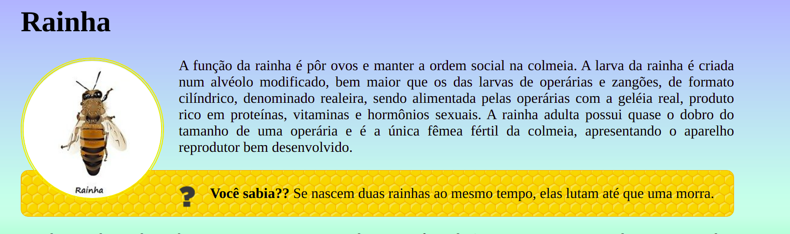

# Abelhas

Uma página sobre abelhas e suas castas.


## Atividade

Crie um pequeno website com 4 páginas informativas sobre as abelhas e suas
castas. Dos 4 arquivos HTML que formam o website das abelhas, 3 já estão
prontinhos e o 4º será criado por você. Além disso, você deve personalizar a
aparência das páginas usando CSS.


### Exercício 1: _setup_

1. [Baixe as imagens e as páginas][seminal-code] que serão usados
1. Descompacte o arquivo `cefet-front-end-bees-master.zip` na área de trabalho
   - Isto criará uma pasta com o nome `cefet-front-end-bees-master` lá
1. **Renomeie** a pasta criada na área de trabalho para `site-abelhas`
   - Esta é a **pasta raiz** do site - onde devem ficar os arquivos `.html`
1. **Abra o arquivo `index.html` no navegador** e verifique que o conteúdo
   da página está lá, mas ela ainda não foi estilizada:
1. Na parte de baixo da página `index.html`, clique nos _links_ para
   "Operárias", "Zangões" e "Rainha". Repare que:
   - As duas primeiras estão criadas, mas não estilizadas
   - A terceira página ainda não existe

[seminal-code]: https://github.com/fegemo/cefet-front-end-bees/archive/refs/heads/main.zip


### Exercício 2: Estilização inicial

Ao fazer este exercício, fique conferindo, no navegador, como a página
está ficando. Se quiser **parar a música**, veja como fazê-lo no [FAQ](#faq).

1. Crie um arquivo `estilos.css` na pasta raiz do site e o inclua na
   página `index.html`
   - Lembre-se que, neste arquivo, apenas código CSS é permitido
     - Ou seja, **não é necessário (nem pode)** usar _tags_, como
       **`<style>...</style>`**
   - Ele deve ser incluído dentro do `<head>...</head>`, preferencialmente
     abaixo do `<title></title>`
1. Configure **o corpo da página**
   - Coloque um fundo em gradiente (escolha as cores)
     - Lembre-se que um gradiente não é o valor para um `background-color`,
       mas para `background-image`
     - Escolha as cores e a direção do gradiente de forma a deixar a
       **página bonita**, **sem atrapalhar sua legibilidade**
   - Aumente o tamanho da fonte para algo como `24px`
   - Coloque uma margem lateral diferente de 0
   - Faça com que a página ocupe toda a altura disponível (como foi
     feito na prática dos piratas)
1. Alinhe o texto de todos os parágrafos de forma justificada (`justify`)
1. Centralize a logomarca (a primeira imagem, lá no alto)
   - Repare que há outras imagens na página, mas você deve centralizar
     apenas a logomarca
     - Para lembrar como fazer isto, veja a explicação sobre
       [seletor de _tag_ _vs_ seletor de `id`][id-selector]
       - Ou seja, atribua um `id` para essa imagem e use-o para estilizá-la
     - E também relembre como [centralizar imagens][centering-imgs]

Até este ponto, a página inicial deve estar mais ou menos assim:


[id-selector]: https://fegemo.github.io/cefet-front-end/classes/html2/#seletor-de-tag-e-id
[centering-imgs]: https://fegemo.github.io/cefet-front-end/classes/html2/#centralizando-imagens


### Exercício 3: Estilizando as **"curiosidades"**

A página `index.html` possui dois parágrafos com a classe `curiosidade`.
Vamos usar isso para poder estiliza-los de forma diferente dos outros
parágrafos.

Queremos deixá-los mais ou menos assim:


1. No arquivo `estilos.css`, crie uma regra CSS para estilizar elementos
   que possuam a classe `curiosidade`
1. Configure a imagem de fundo dos favos de mel
1. Coloque uma borda de 1px, sólida, com a cor dos contornos dos favos de mel
   - Como descobrir uma cor?
     - Veja no [FAQ](#faq)
1. Deixe a borda arredondada
   - A propriedade para deixar a borda arredondada é `border-radius` e
     ela recebe 1 tamanho, que pode ser expresso como `5px` (por exemplo)
1. Coloque um espaçamento interno (`padding`) para que o texto não
   fique grudado na borda


Além do parágrafo, há uma imagem de interrogação dentro do parágrafo. Repare
que essa imagem aparece duas vezes na página `index.html` e também
aparece nos outros arquivos, e ela possui uma classe `icone-curiosidade`.
Estilize de forma que essa <u>imagem</u>:

1. Flutue à esquerda
1. Tenha um espaçamento externo (_i.e._, margem) à direita para que o
   texto não fique grudado nela


### Exercício 4: As páginas `operarias.html` e `zangoes.html`

Agora vamos aproveitar que escrevemos o código CSS em um arquivo separado
e vamos simplesmente incluí-lo nas páginas `operarias.html` e `zangoes.html`.

1. **Inclua o arquivo `estilos.css`** nas páginas `operarias.html` e
   `zangoes.html`, da mesma forma que foi feito para `index.html`
   - Teste e veja se está tudo certo nas duas páginas

As duas páginas possuem uma imagem logo antes do primeiro parágrafo. Vamos
estilizar as duas de forma que elas fiquem arredondadas e com uma borda bacana:


1. Veja se **as duas imagens possuem uma classe** que podemos usar para
   estilizar ambas (``). Então, crie uma regra e:
   1. Arredonde as bordas mas, em vez de colocar um valor em pixels,
      coloque `50%`
      - Isto fará com que a imagem fique circular :wink:
   1. Coloque uma borda bacana

Agora, vamos colocar a imagem flutuando, para que o texto fique ao redor
dela. Queremos que, na página das `operarias.html`, a imagem flutue à
esquerda e, na página dos `zangoes.html`, ela flutue à direita. Além da
flutuação, coloque também uma margem à direita ou à esquerda (depende do
caso) para que o texto não fique grudado na imagem:


**Dica**: você pode (a) criar um `id` para cada uma das duas imagens, ou
então (b) colocar mais uma classe para cada imagem (_e.g._,
`` e
``) e estilizar usando
essas novas classes, _e.g._:

```css
.esquerda {
  float: left;
  margin-right: 10px;
}
```


### Exercício 5: Parágrafo com _link_ para voltar

Nas páginas `operarias.html` e `zangoes.html` há um parágrafo,
o último, que contém um _link_ para voltar à página inicial.

Estilize esse parágrafo alinhando-o à direita ([como alinhar texto de um parágrafo?](https://fegemo.github.io/cefet-front-end/classes/html1/#css-alinhamentoTexto)).


### Exercício 6: Criando a página `rainha.html`

Crie a página que está faltando, `rainha.html`, contendo:

- Título de primeiro nível `Rainha`
- Imagem `imgs/rainha.png`
- 1 parágrafo:
  - A função da rainha é pôr ovos e manter a ordem social na colmeia. A
    larva da rainha é criada num alvéolo modificado, bem maior que os
    das larvas de operárias e zangões, de formato cilíndrico, denominado
    realeira, sendo alimentada pelas operárias com a geléia real,
    produto rico em proteínas, vitaminas e hormônios sexuais. A rainha
    adulta possui quase o dobro do tamanho de uma operária e é a única
    fêmea fértil da colmeia, apresentando o aparelho reprodutor bem
    desenvolvido.
- 1 curiosidade:
  - **Você sabia??** Se nascem duas rainhas ao mesmo tempo, elas
    lutam até que uma morra.
- 1 parágrafo:
  - A vida reprodutiva da rainha inicia-se com o voo nupcial
    para sua fecundação que ocorre, aproximadamente, 5 a 7 dias depois
    de seu nascimento. A fecundação ocorre com a congregação com
    Zangões. Aí existem de centenas a milhares de zangões voando à espera
    de uma rainha, conferindo assim uma grande variedade genética
    no acasalamento.
- 1 curiosidade:
  - **Você sabia??** A abelha rainha vive até dois anos,
    enquanto as operárias não duram mais que um mês e meio.
- Parágrafo com _link_ para voltar


A imagem da abelha rainha deve flutuar à esquerda, assim como a imagem
das operárias:



Repare que, dependendo da largura do navegador, a imagem dos favos de mel
do parágrafo `.curiosidade` pode ficar atrás da rainha (que flutua).

Isso é normal e esperado para flutuação! Lembre-se: elementos _block_
ignoram quem está flutuando e apenas "sobe" para ocupar o espaço; e
os _inline "respeitam" a forma de quem está flutuando.

Portanto, **não é necessário fazer nada** para corrigir isso. Se quiser evitar,
uma forma seria interromper a flutuação.


### Exercício 7: Incluindo `abelhinhas.js`

Descubra como fazer que uma página HTML use um arquivo JavaScript. Para isso,
pesquise no Google por
["como inserir javascript na página html"][pesquisa-script] ou algo assim.

Nos resultados, você poderá perceber existe a _tag_ `<script></script>` e que
há pelo menos duas formas: (a) escrever código JavaScript dentro dessa
_tag_ ou (b) referenciar um arquivo JavaScript que já existe.

Use **<u>esta última</u> opção** e inclua o arquivo `abelhinha.js`
**logo antes do final do `<body>...</body>`**.

[pesquisa-script]: https://www.google.com/search?q=como+inserir+javascript+no+html&sxsrf=AOaemvIdD0vyn9Bm8uYc8aRsCaaS-_3WQQ%3A1631906717071&source=hp&ei=netEYZJs1arWxA_ukZDoBA&iflsig=ALs-wAMAAAAAYUT5rTy1gylKhvbEGWSTCJyyWQm73Qhx&oq=como+inserir+javascript&gs_lcp=Cgdnd3Mtd2l6EAMYADIFCAAQgAQyBQgAEIAEMgYIABAWEB4yBggAEBYQHjIGCAAQFhAeMgYIABAWEB4yBggAEBYQHjIGCAAQFhAeMgYIABAWEB46BwgjEOoCECc6BAgjECc6BggjECcQEzoLCC4QgAQQsQMQgwE6CwgAEIAEELEDEIMBOg4ILhCABBCxAxDHARCjAjoRCC4QgAQQsQMQgwEQxwEQowI6CwguEIAEEMcBEKMCOgUILhCABDoICC4QgAQQsQM6CAgAEIAEELEDOgUIABCxA1CTGFi7LWDrNWgCcAB4AIABnQGIAbYXkgEEMC4yM5gBAKABAbABCg&sclient=gws-wiz


## FAQ

FAQ é uma sigla para _Frequently Asked Questions_ que, em Português, traduz
em **Perguntas Feitas com Frequência**. A seguir, veja algumas questões que
podem surgir ao fazer este exercício, bem como as suas respostas.

### Como descobrir uma cor?

Você pode usar um editor de imagens como Paint.NET, Pinta, Gimp, Photoshop. Ou então, você pode abrir as **"ferramentas do desenvolvedor"** do navegador (_e.g._, Chrome, Firefox) e escolher uma cor por lá.

Veja como isso foi feito nos slides da aula [CSS parte 1][escolhendo-cores].

[escolhendo-cores]: https://fegemo.github.io/cefet-front-end/classes/css1/#escolhendo-cores

### Como faço para parar a música????

Na página `index.html` há um elemento `<audio></audio>` dentro do corpo. Você
pode remover o atributo `autoplay`, ou então colocar um novo atributo
`controls`.

No primeiro caso (atributo `autoplay`), a música continuará lá, mas não
iniciará automaticamente. No segundo caso (atributo `controls`), sugirgão
controles para parar/pausar/iniciar a música dentro da página. Faça o teste!
